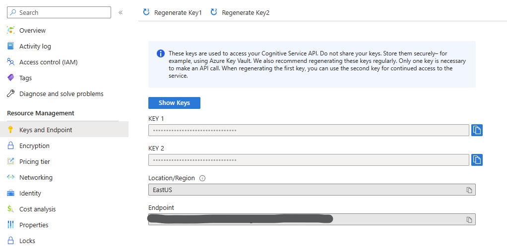

# Azure AI Content Safety Authentication

Each request to an Azure Cognitive Service must include an authentication header. This header passes along a subscription key or authentication token, which is used to validate your subscription for a service or group of services.

There are two kinds of authentication headers available for Azure AI Content Safety Service.
| Header | Description |
|--------|-------------|
| Ocp-Apim-Subscription-Key | Use this header to authenticate with a subscription key for a specific service or a multi-service subscription key. |
| Authorization | Use this header if you are using an access token. The steps to perform a token exchange are detailed in the following sections. The value provided follows this format: `Bearer <TOKEN>`. |

## Authenticate with API key

If you have created your Content Safety resource, you can go to azure portal, click into the resource, and find the keys under `Keys and Endpoint` tab.



If you are making http request to Restful API directly, you could set this value to `Ocp-Apim-Subscription-Key` in http header. In C# it may look like:

```csharp
HttpClient client = new();
client.DefaultRequestHeaders.Add("Ocp-Apim-Subscription-Key", "[Your API Key]");
```

If you are using Azure AI Content Safety SDK, you should create an [`AzureKeyCredential`](https://learn.microsoft.com/en-us/dotnet/api/azure.azurekeycredential?view=azure-dotnet) with this key, then construct the `ContentSafetyClient`. In dotnet SDK it may look like:

```csharp
string endpoint = "[Your endpoint]";
string key = "[Your subscription key]";

ContentSafetyClient client = new ContentSafetyClient(new Uri(endpoint), new AzureKeyCredential(key));
```

## Authenticate with Azure Active Directory

While the keys provide a quick and easy path to start development, they fall short in more complex scenarios that require Azure role-based access control (Azure RBAC). In this scenario, you will need to authenticate with Azure Active Directory(AAD).

**Currently we only support AAD authentication when calling Restful API by http directly, SDKs will support it in later versions.**

### Enable AAD for your resource

Please refer to this [Cognitive Services authentication document](https://learn.microsoft.com/en-us/azure/cognitive-services/authentication?tabs=powershell#authenticate-with-azure-active-directory) for the steps to enable AAD for your resource.
The main steps are:

- Create resource with a custom subdomain.
- Create Service Principal and assign `Cognitive Services User` role to it.

### Authenticate with AAD

With AAD enabled, you could take hands to write your authentication code. In C#, you can leverage [Azure.Identity](https://github.com/Azure/azure-sdk-for-net/tree/main/sdk/identity/Azure.Identity) library to get credential.

### Authorize access to managed identities

When authenticating with AAD, a common challenge for developers is the management of secrets, certificates, used to secure communication between services. Managed identities eliminate the need for developers to manage these credentials.

For more information, please refer to [Authorize access to managed identities](https://learn.microsoft.com/en-us/azure/cognitive-services/authentication?tabs=powershell#authorize-access-to-managed-identities).

We leverage `ManagedIdentityCredential` in [Azure.Identity](https://github.com/Azure/azure-sdk-for-net/tree/main/sdk/identity/Azure.Identity) library to get credential.

#### Authenticate with a system-assigned managed identity

```csharp
HttpClient client = new();

var credential = new ManagedIdentityCredential();
var context = new TokenRequestContext(scopes: new[] { "https://cognitiveservices.azure.com/.default" }, tenantId: "[Your tenant id]");
string token = "Bearer " + credential.GetToken(context).Token;

client.DefaultRequestHeaders.Add("Authorization", token);
```

#### Authenticate with a user-assigned managed identity

```csharp
HttpClient client = new();

var credential = new ManagedIdentityCredential(clientId: "[User Assigned ClientId]");
var context = new TokenRequestContext(scopes: new[] { "https://cognitiveservices.azure.com/.default" }, tenantId: "[Your tenant id]");
string token = "Bearer " + credential.GetToken(context).Token;

client.DefaultRequestHeaders.Add("Authorization", token);
```

For complete sample to call Restful API by http using managed identity, please refer to [Restful_ManagedIdentity.cs](./Restful_ManagedIdentity.cs)
